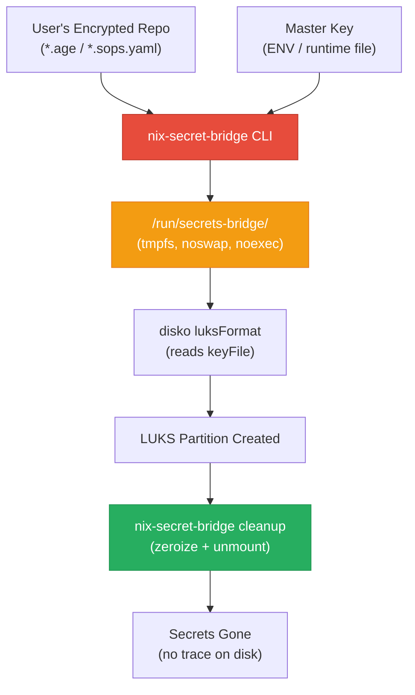

# nix-secret-bridge — Design Document

**Version**: 0.1.0  
**Author**: Mutasem Kharma  
**Date**: 2026-05-13  
**Status**: Pre-RFC Draft  

---

## 1. Executive Summary

`nix-secret-bridge` is a purpose-built CLI tool and NixOS module that solves the
**bootstrap secret paradox**: the inability to provide decrypted secrets (LUKS
passwords, disk encryption keys) during the initial disk partitioning phase of a
NixOS deployment, before the target system is booted.

Today, tools like `sops-nix` and `agenix` only activate as systemd services
**after** the system has booted. `disko` needs LUKS passphrases during
`luksFormat`, which runs in the installer environment (live USB or
`nixos-anywhere` SSH session). There is no standard mechanism to bridge this gap.

`nix-secret-bridge` closes this gap by running in the installer environment,
decrypting secrets from age or SOPS encrypted files using existing user keys, and
exposing them on a tmpfs mount point that `disko` can consume — all without ever
writing decrypted material to persistent storage.

---

## 2. High-Level Architecture

```
┌──────────────────────────────────────────────────────────────────┐
│                    INSTALLER ENVIRONMENT                         │
│            (Live USB / nixos-anywhere SSH session)                │
│                                                                  │
│  ┌─────────────────────┐     ┌──────────────────────────────┐   │
│  │  User's Encrypted   │     │  Master Key Source            │   │
│  │  Secret Files        │     │  ┌─────────────────────┐     │   │
│  │  (.age / .sops.yaml) │     │  │ ENV var             │     │   │
│  │                      │     │  │ --master-key-file   │     │   │
│  │  (from repo / flake) │     │  │ runtime file/env    │     │   │
│  └──────────┬───────────┘     │  │ sources             │     │   │
│             │                 │  └──────────┬──────────┘     │   │
│             │                 └─────────────┼────────────────┘   │
│             │                               │                    │
│             ▼                               ▼                    │
│  ┌──────────────────────────────────────────────────────────┐   │
│  │              nix-secret-bridge CLI                        │   │
│  │                                                          │   │
│  │  1. Parse secret mapping (config or CLI args)            │   │
│  │  2. Select backend (age | sops)                          │   │
│  │  3. Decrypt in-memory (Vec<u8>)                          │   │
│  │  4. Mount tmpfs at /run/secrets-bridge/                  │   │
│  │  5. Write decrypted bytes (mode 0400, root:root)         │   │
│  │  6. Zeroize in-memory buffer immediately                 │   │
│  └─────────────────────┬────────────────────────────────────┘   │
│                         │                                        │
│                         ▼                                        │
│  ┌──────────────────────────────────────────────────────────┐   │
│  │            /run/secrets-bridge/ (tmpfs)                   │   │
│  │                                                          │   │
│  │  luks-key       0400  root:root  (decrypted bytes)       │   │
│  │  luks-key-data  0400  root:root  (optional: 2nd secret)  │   │
│  └─────────────────────┬────────────────────────────────────┘   │
│                         │                                        │
│                         ▼                                        │
│  ┌──────────────────────────────────────────────────────────┐   │
│  │                  disko (luksFormat)                       │   │
│  │                                                          │   │
│  │  encryption.keyFile = "/run/secrets-bridge/luks-key"      │   │
│  │  → cryptsetup luksFormat --key-file /run/secrets-bridge/… │   │
│  └──────────────────────────────────────────────────────────┘   │
│                                                                  │
│  ┌──────────────────────────────────────────────────────────┐   │
│  │           nix-secret-bridge cleanup                      │   │
│  │                                                          │   │
│  │  1. Overwrite secret files with zeros                    │   │
│  │  2. Unlink files                                         │   │
│  │  3. Unmount /run/secrets-bridge/                         │   │
│  └──────────────────────────────────────────────────────────┘   │
└──────────────────────────────────────────────────────────────────┘
```

### Architecture Diagram (Mermaid)



---

## 3. Detailed Flow

### 3.1 User Configuration (Nix)

The user defines secret references in their `disko` + `nix-secret-bridge`
configuration:

```nix
# configuration.nix (or disko-config.nix)
{
  services.nix-secret-bridge = {
    enable = true;
    backend = "age";

    secretMapping = {
      "luks-key" = {
        encryptedFile = ./secrets/luks-key.age;
        outputPath = "/run/secrets-bridge/luks-key";
      };
    };

    provider = {
      masterKeyPath = null;  # use NIX_SECRET_BRIDGE_AGE_KEY env var
    };

    diskoIntegration = true;  # auto-hook into disko ordering
  };

  disko.devices.disk.main = {
    type = "disk";
    device = "/dev/vda";
    content = {
      type = "gpt";
      partitions.luks = {
        size = "100%";
        content = {
          type = "luks";
          name = "cryptroot";
          settings = {
            # ← This path is provided by nix-secret-bridge
            keyFile = "/run/secrets-bridge/luks-key";
            keyFileSize = 4096;
          };
          content = {
            type = "filesystem";
            format = "ext4";
            mountpoint = "/";
          };
        };
      };
    };
  };
}
```

### 3.2 Runtime Steps (Installer Environment)

| Step | Actor | Description |
|------|-------|-------------|
| 1 | `nixos-anywhere` | SSHs into the target machine, enters installer env |
| 2 | systemd | Starts `nix-secret-bridge.service` (ordered `Before=disko.service`) |
| 3 | `nix-secret-bridge` | Reads config: finds `luks-key.age` mapped to `/run/secrets-bridge/luks-key` |
| 4 | `nix-secret-bridge` | Locates the master key from `$NIX_SECRET_BRIDGE_AGE_KEY` or `--master-key-file` |
| 5 | `nix-secret-bridge` | Calls `rage::decrypt()` (age backend) or `sops --decrypt` (sops backend) |
| 6 | `nix-secret-bridge` | Mounts a dedicated tmpfs at `/run/secrets-bridge/` with `noswap,noexec,nosuid,size=1m` when supported, falling back without `noswap` on older kernels |
| 7 | `nix-secret-bridge` | Writes decrypted bytes to `/run/secrets-bridge/luks-key` with mode `0400`, owner `root:root` |
| 8 | `nix-secret-bridge` | Zeroizes the in-memory buffer using the `zeroize` crate |
| 9 | `disko` | `disko.service` starts, reads `/run/secrets-bridge/luks-key`, calls `cryptsetup luksFormat` |
| 10 | systemd | `nix-secret-bridge-cleanup.service` (ordered `After=disko.service`) triggers |
| 11 | `nix-secret-bridge cleanup` | Overwrites file contents with zeros, unlinks, unmounts tmpfs |

### 3.3 Key Provisioning Methods

| Method | Flag / Env | Use Case |
|--------|-----------|----------|
| Environment variable | `NIX_SECRET_BRIDGE_AGE_KEY` | CI/CD, automated deployments |
| File path | `--master-key-file /tmp/age-key.txt` | `nixos-anywhere` copying key via SSH |
Hardware-backed age plugin identities and SSH age identities are deliberately
out of scope for the initial native age backend. They should only be enabled
after automated tests cover unattended installer execution and the extra
dependency surface has been reviewed.

---

## 4. Security Guarantees

### 4.1 Threat Model

| Threat | Mitigation |
|--------|-----------|
| Secret persisted to disk | Decrypted data exists only on tmpfs (`noswap`). Never written to `/nix/store` or any persistent filesystem. |
| Secret in swap | tmpfs mounted with `noswap` where supported. Decrypt operations fail unless process memory is locked with `mlockall(MCL_CURRENT | MCL_FUTURE)`. |
| Secret in logs | `nix-secret-bridge` never logs decrypted content. All log messages are sanitized. `StandardOutput=null` on the systemd unit. |
| Secret in core dump | `prctl(PR_SET_DUMPABLE, 0)` set at process start. |
| Secret in `/nix/store` | Encrypted files may be in the store (this is fine — they're encrypted). Decrypted content is never part of a derivation output. |
| Use-after-free of secret | Rust's ownership model + `zeroize::Zeroize` trait on all buffers holding decrypted data. |
| Race condition on tmpfs | Files written with `O_EXCL | O_CREAT`, permissions set before content written (using `fchmod` on fd). |

### 4.2 Memory Safety

- All decrypted byte buffers are wrapped in `zeroize::Zeroizing<Vec<u8>>`.
- On drop, the buffer is overwritten with zeros before deallocation.
- `mlockall(MCL_CURRENT | MCL_FUTURE)` is called before decrypting secret material.
- The Rust binary is compiled with `panic = "abort"` to prevent unwinding from
  leaking stack frames.

### 4.3 Filesystem Safety

- The tmpfs mount is created with: `mount -t tmpfs -o size=1m,noswap,noexec,nosuid,nodev,mode=0700 none /run/secrets-bridge`
- On kernels that reject `noswap`, the tool falls back to `size=1m,noexec,nosuid,nodev,mode=0700` after process memory has been locked.
- Individual secret files are written with mode `0400` (read-only by root).
- Cleanup overwrites file content with zeros before unlinking.
- The tmpfs is unmounted after cleanup, ensuring no residual data.

---

## 5. Backend Plugin Architecture

```
nix-secret-bridge
├── backends/
│   ├── mod.rs          # Backend trait definition
│   ├── age.rs          # age/rage decryption
│   ├── sops.rs         # sops decryption
│   └── plugin.rs       # External plugin support (future, not implemented)
├── mount.rs            # tmpfs mounting and file writing
├── cleanup.rs          # Secure cleanup logic
└── main.rs             # CLI entry point
```

The `Backend` trait:

```rust
pub trait SecretBackend: Send + Sync {
    /// Human-readable name for error messages
    fn name(&self) -> &str;

    /// Decrypt an encrypted file, returning the raw decrypted bytes.
    /// The caller is responsible for zeroizing the returned buffer.
    fn decrypt(
        &self,
        encrypted_path: &Path,
        key_source: &KeySource,
    ) -> Result<Zeroizing<Vec<u8>>, BackendError>;
}
```

New backends can be added by:
1. Implementing the `SecretBackend` trait.
2. Registering in the backend registry (`backends/mod.rs`).
3. Adding a new variant to the `BackendType` enum in the NixOS module.

---

## 6. Integration Points

### 6.1 disko

`nix-secret-bridge` integrates with `disko` via systemd ordering:

- `nix-secret-bridge.service` runs **before** `disko.service`
- `nix-secret-bridge-cleanup.service` runs **after** `disko.service`
- The user's disko config references paths under `/run/secrets-bridge/`

### 6.2 nixos-anywhere

`nixos-anywhere` can provide the master key via SSH:

```bash
# Copy the master key to the target before running nixos-anywhere
nixos-anywhere --extra-files /tmp/age-key.txt:/tmp/age-key.txt \
  --flake .#myhost root@target

# Or via environment variable forwarding
NIX_SECRET_BRIDGE_AGE_KEY=$(cat ~/.config/sops/age/keys.txt) \
  nixos-anywhere --flake .#myhost root@target
```

### 6.3 agenix / sops-nix

`nix-secret-bridge` is **complementary** to these tools:

- **Pre-boot**: `nix-secret-bridge` handles decryption in the installer env
- **Post-boot**: `agenix` / `sops-nix` handle runtime secret management

The same encrypted files and the same master keys are used by both tools. No
re-keying is required.

### 6.4 nixos-facter (Future)

Integration with `nixos-facter` is planned for TPM2-sealed secrets:

- `nixos-facter` probes hardware and generates a `facter.json`
- `nix-secret-bridge` could use TPM2 PCR values from `facter.json` to unseal
  keys bound to specific hardware configurations

This is listed as an **unresolved question** for the RFC process.

---

## 7. Non-Goals

- **Replacing agenix/sops-nix**: This tool operates only during the bootstrap
  phase. It does not manage runtime secrets.
- **Key generation**: This tool does not generate encryption keys. Users must
  create their LUKS key files and encrypt them with their preferred tool.
- **Network access during decryption**: The tool operates fully offline. All
  encrypted files and keys must be available locally.
- **Supporting non-NixOS systems**: This is a NixOS-specific tool that integrates
  with the NixOS module system and `disko`.
